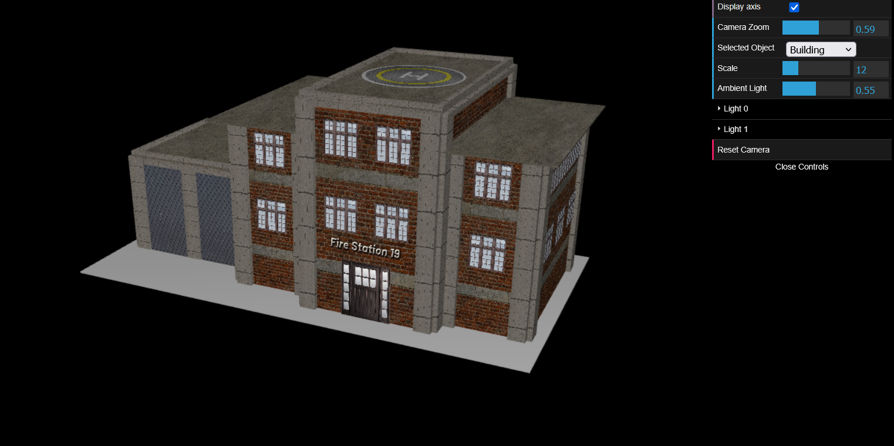

# CG 2024/2025

## Group T10G11

## Project Overview

This project is a 3D interactive scene featuring a firefighters building, a helicopter, a forest and a lake inside a panorama.
The main objective is for the helicopter to catch the water from the lake and put out a fire that is located in the forest.

---

## 1. Sky-sphere

### 1.1 Creating a sphere
A large sphere is modeled to serve as the background, enveloping the entire scene.

### 1.2 Adding Panoramas
High-resolution panoramic textures are mapped onto the inner surface of the sphere for an immersive environment.

**Screenshots:**  
  
  

---

## 2. Fire-fighters Building

### 2.1 Representation of window
The building features detailed window models with transparent materials and reflections.

### 2.2 Representation of the building
The fire-fighters building is modeled with architectural details, textured walls, doors, and a garage.

**Screenshot:**  

---

## 3. Trees and Forest

### 3.1 Modeling a tree
Each tree is constructed from parametric trunk and foliage components.

### 3.2 Parameterization of the tree
Tree parameters such as height, trunk radius, tilt, and foliage color are randomized.

### 3.3 Forest creation
A forest is generated by placing multiple trees in a grid with random offsets.

### 3.4 Textures on trees
Custom bark and leaf textures are applied to trunks and foliage.

**Screenshot:**  

---

## 4. Helicopter

### 4.1 Helicopter modeling
The helicopter is modeled with detailed body, tail, wings, and bucket components.

### 4.2 Helicopter animation
Animations include spinning rotors, moving tail, and dynamic bucket operations.

### 4.3 Helicopter control
User input allows for interactive control of the helicopter’s position and actions.

**Screenshots:**  
  

---

## 5. Water and Fire

### 5.1 Shaders and animation
Custom shaders animate water surfaces and fire effects.

### 5.2 Flames ripple
A ripple effect is applied to flames, simulating heat distortion.

**Screenshots:**  
  

---

## 6. Heliport in maneuvers
A heliport is modeled and textured, serving as a landing and takeoff area for the helicopter.
Accompanied by strobe lights indicating the ascent and descent of the helicopter.

**Screenshot:**  

---

## 7. Additional developments
The extra feature implemented was the feature `B`:
- Depending on the type of maneuver, the heliport must alternate between two textures with the letter "H" and the letters "DOWN" or "UP", but mixing the textures in the transitions. Mixing must be carried out based on shaders.

---