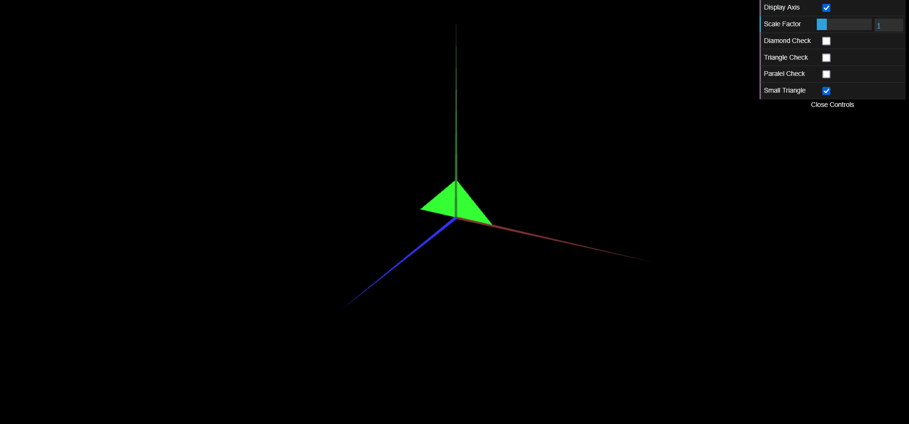
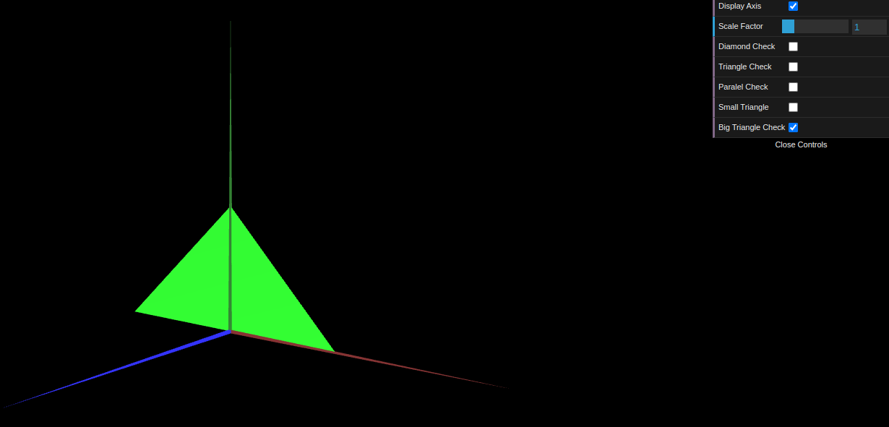

# CG 2024/2025

## Group T10G11

## TP 1 Notes

- We learned the dynamic between the interface, scene and objects
- Overall the exercises were pretty simple but the indexes caused some confusion

### Diamond

### Small Triangle

### Big Triangle

