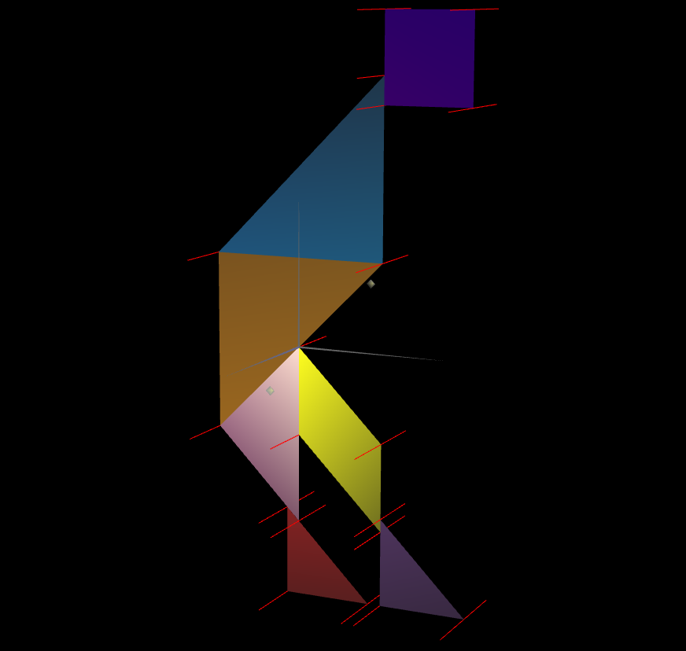

# CG 2024/2025

## Group T10G11

## TP 3 Notes

#### Note: We used the tangram 128 mod 123 -> 5

---

- The first part helped us get hands on the normals and materials. 

### Initial Tangram Implementation

- We tried two different approaches for the cube and tangram. The one used on the cube proved to be a little annoying because of our initial aproach, which was caused by our bad interpretation.

### Unit Cube Normals

### Unit Cube Wood Texture

### Tangram Normals

### Tangram Custom

---

- The second part consolidated the knowledge about the normals and their appliance in three-dimensional shapes

### Prism Implementation

- This exercise proved to be a little more difficult compared to previous exercises, as to be expecting when switching from 2d to 3d.
The hardest part was defining the normals for each vertex and getting them to be correctly positioned.

### Prism

### Prism With Normals Displayed

---

### Cylinder Implementation

- This last exercise reinforced our preception on how normals affect lighting. With the knowledge from the previous exercises, this one proved to be easy.

### Cylinder

### Cylinder With Normals Displayed

### Round Cylinder

