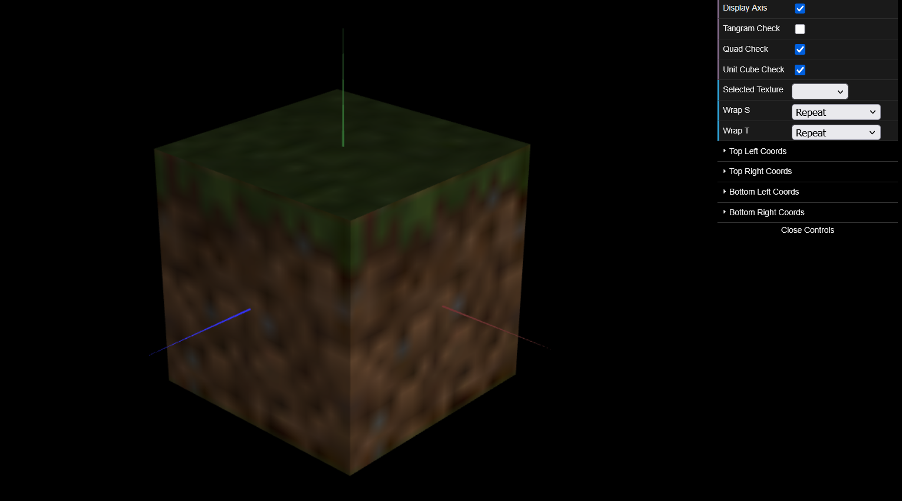
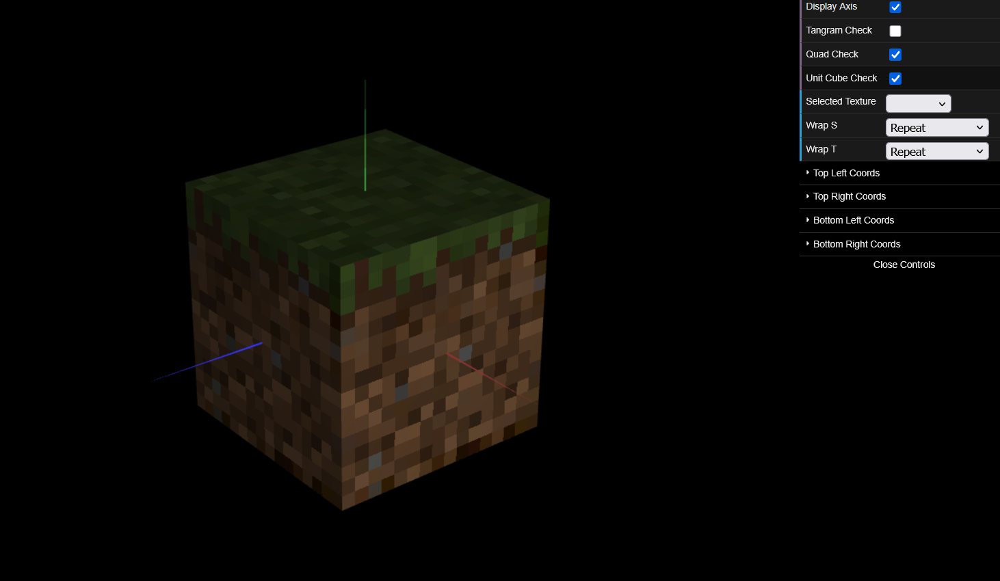

# CG 2024/2025

## Group T10G11

## TP 4 Notes

---
## First Exercise - Applying Textures to Tangram

- `missing`

---

## Second Exercise - Applying Textures to a Cube

### Cube Implementation

- The initial part was rather easy since it was code reused from previous classes and exercises. Only needing to adjust some geometric transformations.

### Textured Cube

- The cube was textured with a Minecraft texture. The texture was applied to each face of the cube. This section also was simple, since just by analyzing the code backbones and the slides provided, we were able to implement it in our cube and in their right places.

### Minecraft Cube (w/ Linear Filtering)

### Minecraft Cube (w/ Nearest Filtering) - Final Version

- Since the original implementation of the texture looked blurry. To fix this we changed the filtering mode being used when applying the texture to each face. Instead of being a Linear Texture Filtering, we changed it to a Nearest Texture Filtering. This change made the texture look more like the original Minecraft texture.

