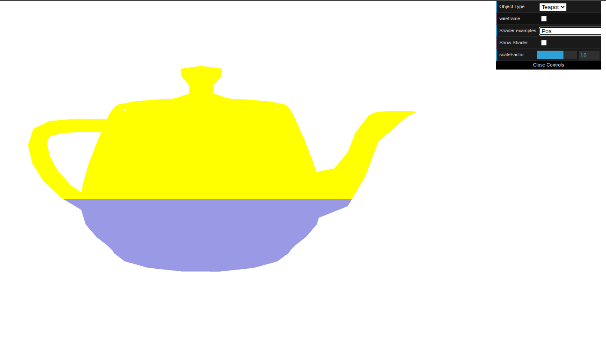
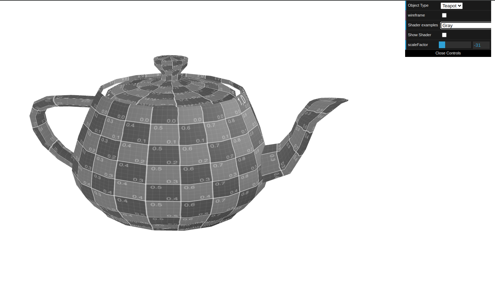
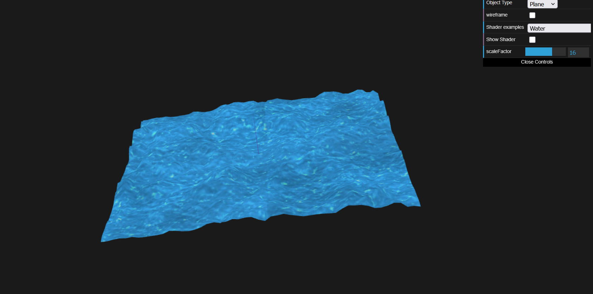

# CG 2024/2025

## Group T10G11

## TP 5 Notes

---
## First Exercise - Applying Shaders to Teapot

- This part of the work was mostly simple. For the first part we based our shader in two already implemented ones, varying and texture3anim. The only part that caused us a little trouble, was how to change the movement based on the offset.

- For the second part, we reimplemented sepia only changing the values of the colors, as instructed.

### Moving Bule 

### Gray Bule

---
## Second Exercise - Applying to Plane : Water Effect

- This part of the work was a little more challenging. We had to implement a shader that would simulate water. We based our work on the texture2 and texture3anim shader. Some new variables were added to the water shader to control the movement and speed of the water.
- This water effect was harder to implement due to the complexity of the waves and the movement of the water. As too not to make the water look either too still or too fast, and also not to make the waves too high or non-existent, we had to adjust the values of the variables (movement and color) in the corresponding shader.

---